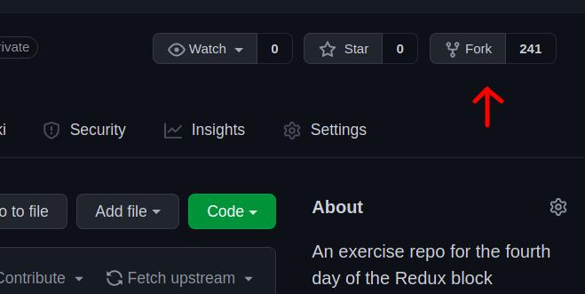

## Orientações para a resolução do exercício:

- Forke o repositório
- Navegue até a pasta do exercício
- Rode o comando npm install
- Vá até o arquivo Home.js em src/pages/home/Home.js
- Siga as instruções

 
[Mais detalhes](https://guides.github.com/activities/forking/) sobre o fork. 

### Durante o desenvolvimento você deve:

- Realizar commits com descrições breves e objetivas

### Ao final do desenvolvimento você deve:

- Subir a resolução do exercício para seu repositório forkado
